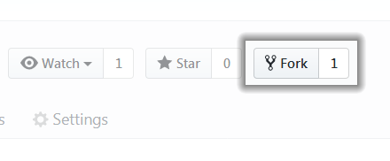
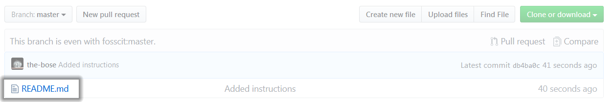
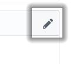
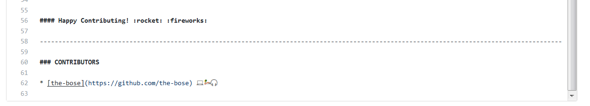
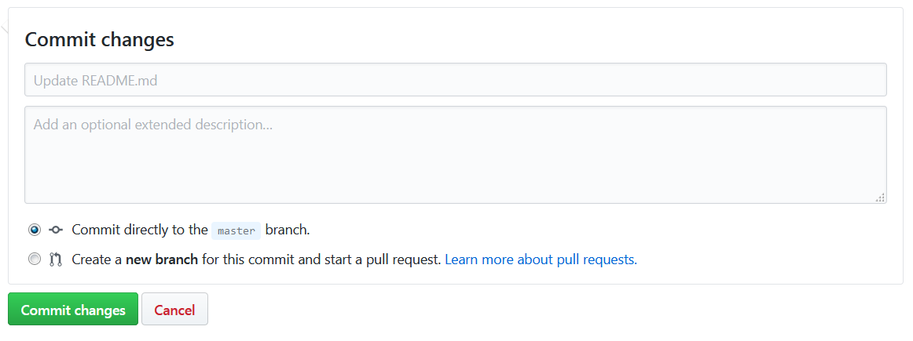
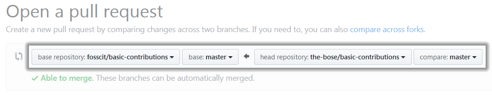

# Basic Contributions - A guide to your first pull request
🚀🌟 The intention of this project is to help you understand how to contribute to any project on GitHub and kick-start your open source contribution journey with **Hacktoberfest**. You will learn this by adding yourself onto this project's contributors list.

### What is Hacktoberfest? :jack_o_lantern:
Hacktoberfest is a month-long celebration of open source software run by DigitalOcean and DEV. You can win a **free T-shirt** :tshirt: if you complete 4 PRs (Pull Requests). For more information and registration, check [here](https://hacktoberfest.digitalocean.com/).

### What is GitHub? :octocat:
GitHub is a code hosting platform for version control and collaboration. It lets you and others work together on projects from anywhere. If it gets a bit overwhelming at first, we recommend you to check [this](https://guides.github.com/activities/hello-world/).


#### IMPORTANT: MAKE SURE THAT YOU HAVE REGISTERED YOUR GITHUB PROFILE WITH HACKTOBERFEST ([HERE](https://hacktoberfest.digitalocean.com/)) BEFORE PROCEEDING.


## How to contribute?
Any type of contribution involves these basic steps:
  1. Forking
  2. Making Changes
  3. Committing changes (to fork)
  4. Pull Request (PR)
  5. Merging

Complex contributions may also involve: Cloning, and Branching. For the sake of simplicity, we won't be covering cloning and making local changes in this tutorial.




### 1. Fork
* A fork is a copy of a repository. Forking a repository allows you to freely experiment with changes without affecting the original project.
* To fork a project, click on the **'Fork'** icon at the top right. A copy of this project will be created in your profile.


### 2. Making Changes
* We will be editing the **'README.MD'** file using GitHub to add your name onto the contributors list.
* Select the README.MD file from project files list and select the EDIT icon.




* Scroll down and add your name onto the **end of** contributors list **in a new line** using this format:
```
  * [your-username](https://www.github.com/your-username) <any-three-emojis>
```



* You are _asked_ to **add any 3 emojis** that you may find interesting/really like/feel that describe you. Check this [link](https://coolsymbol.com/emojis/emoji-for-copy-and-paste.html) to search and copy-paste emojis or [this](https://gist.github.com/rxaviers/7360908) for GitHub-standard emojis.
* .MD files use MARKDOWN markup language to format the text. For a cheat sheet, check [this](https://github.com/adam-p/markdown-here/wiki/Markdown-Cheatsheet).




### 3. Committing Changes
* Scroll down to the **'Commit changes'** pane.
* Type a title for your commit.
* Click on the **'Commit changes'** button.
* The changes that you've made have been **committed to your fork**.


### 4. Pull Request (PR)
* A **'Pull Request'** is essentially a request to the author of the original repository to accept the changes you've made to your fork.
* Start by heading to the [original repository (basic-contributions)](https://github.com/fosscit/basic-contributions).
* To the right of the Branch menu, click **'New pull request'**.


* On the Compare page, click **'compare across forks'**.


* Confirm that the **base fork** _(the one on the left)_ is the repository you'd like to merge changes into.
* Select **your fork** _on the right_.



* Type a title for your pull request like **'add(user):your-username'**.
* Select **'Create Pull Request'**.


### 5. Merging
* Merging your changes to the master fork is done by the owner.
* So, wait it out, and congratulations on making your first PR! 


#### Happy Contributing! :rocket: :fireworks:


--------------------------------------------------------------------------------------------------------------------------------------------


### CONTRIBUTORS

* 🌟 [the-bose](https://github.com/the-bose) 💻🦆🎧
